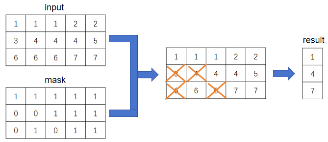
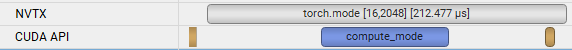
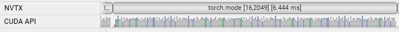

## 简介

实现功能：对输入矩阵逐行求**众数**，且掩码矩阵为0的位置不参与统计。



## 背景

实验室有个比特级稀疏训练算法，里面有个需求，简单来说是：给定一个矩阵A，求A各行的众数，其中A的元素大小范围为0~8；当传入相同大小的矩阵mask时，mask为0的位置将不参与统计。

PyTorch本身有torch.mode用来求众数，但它有两个问题：

- **当求众数的维度较长时，执行速度很慢**。在我们的需求中，A列数通常较大，通过Profiling发现torch.mode成为了整个算法的性能瓶颈。

- **不支持掩码功能，需绕弯实现**。进一步加剧了性能问题。

所以，torch.mode在该场景下不好用，于是干脆自己实现了一个带掩码求众数的cuda kernel。它采用类似于基数排序的方法进行计数，并跳过mask为0的位置。最终满足了需求，使我们的训练算法能高效地跑起来。


## 操作说明

**安装:**

```
python setup.py develop
```

**测试:**

```
python test.py
```

**使用：**

```python
# 导入包
from mask_mode import mask_mode

# 定义input和mask张量
# ......

# 调用mask_mode完成计算
mode = mask_mode(input, mask)
```

- 输入两个张量input和mask，要求:
    - 二者都是2维的torch.Tensor张量，dtype=torch.int8且device=cuda
    - 二者行数不超过65536；列数没有限制
    - input每个元素的范围为[0,8]，mask每个元素的范围为[0,1]

mask_mode算子将统计input每一行的众数，且mask=0的位置不计入统计

（因为当时想要在最快时间内写出该kernel，所以在满足需求的前提下，强加了一些限制条件，来减少需要考虑的情况。未来如果有新的需求，可以把上述限制条件一个个放宽或解除。）


## 性能对比

这里做了一下和torch.mode的性能对比。输入矩阵的大小为shape，每个元素大小均为0~8。这里比较性能时没有考虑掩码矩阵。在A100 GPU上进行测试。

| shape    | torch.mode(dim=1) | my mode  |
| -------- | ----------------- | -------- |
| 16,4096  | 3.234 ms          | 0.118 ms |
| 16,8192  | 3.323 ms          | 0.12 ms  |
| 32,4096  | 6.419 ms          | 0.122 ms |
| 32,8192  | 6.605 ms          | 0.123 ms |
| 64,4096  | 12.706 ms         | 0.123 ms |
| 64,8192  | 13.208 ms         | 0.124 ms |
| 128,4096 | 25.916 ms         | 0.124 ms |
| 128,8192 | 26.244 ms         | 0.125 ms |


## torch.mode慢的原因

首先测一下性能，发现torch.mode在输入长度（求众数的维度的长度）超过2048时，性能有断崖式下降。

| shape    | torch.mode(dim=1) |
| -------- | ----------------- |
| 16, 2046 | 0.056 ms          |
| 16, 2047 | 0.056 ms          |
| 16, 2048 | 0.054 ms          |
| 16, 2049 | 2.803 ms          |
| 16, 2050 | 2.796 ms          |

阅读源码，发现输入长度不同时，采用的是不同的实现

https://github.com/pytorch/pytorch/blob/7bc91d5dc2f7dcde34b7d71fb6ef3de578c59876/aten/src/ATen/native/cuda/TensorModeKernel.cpp#L77-L93

前者1个kernel就能搞定，后者继续读源码会发现，其包含大量的cuda kernel调用，进而会带来大量的kernel launch开销和global memory access的开销。下面是NsightSystem测到的矩阵大小分别为[16,2048]和[16,2049]时的结果。





后续思考一下，怎么能在torch.mode原有实现基础上进行优化，支持通用场景。